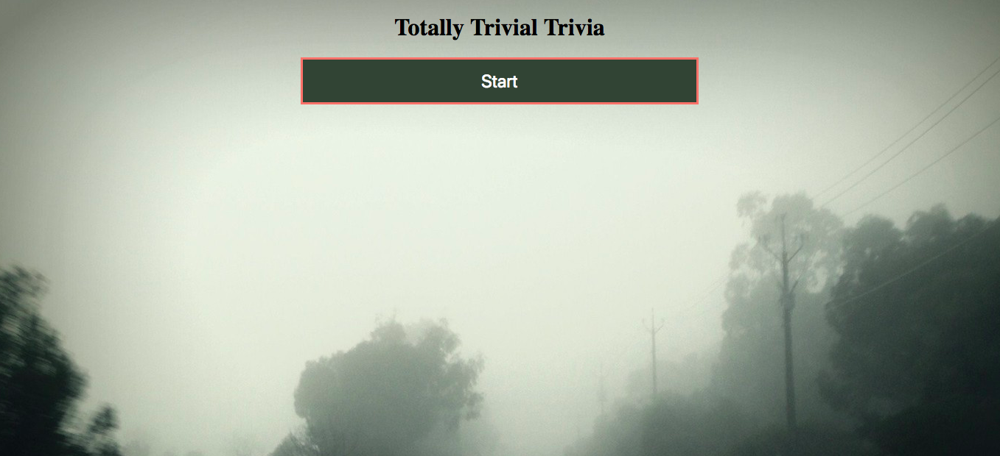
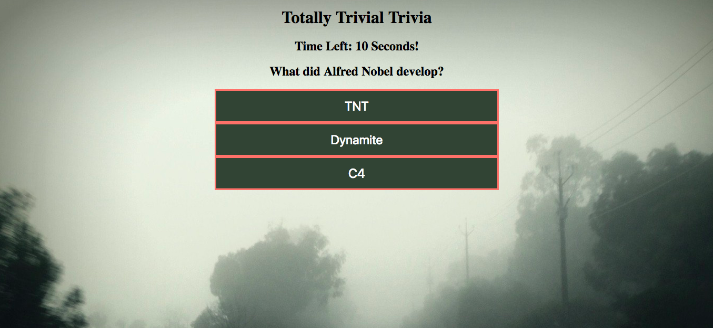
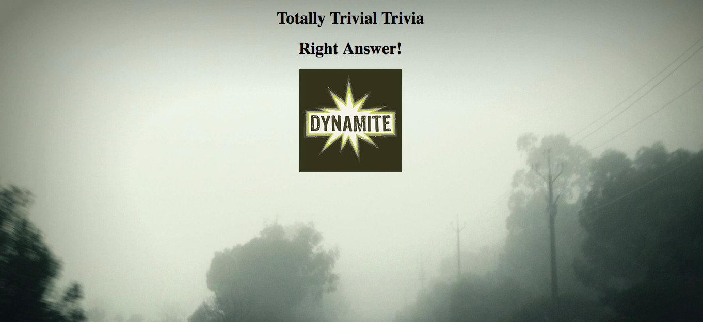
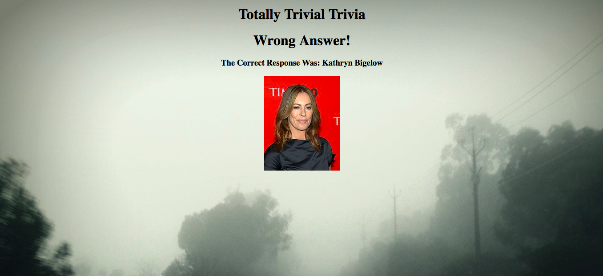
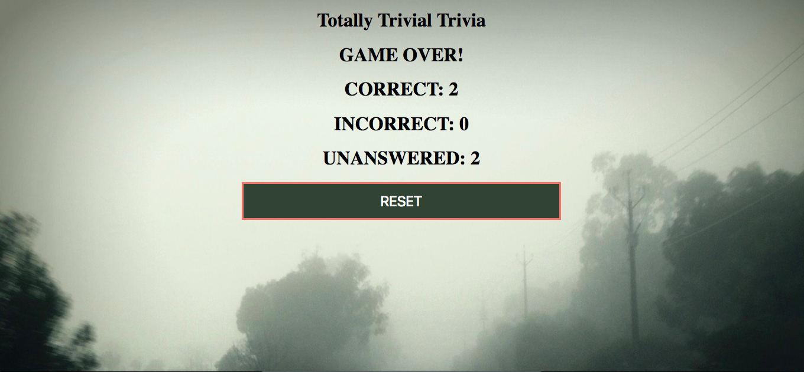

# Totally Trivial Trivia
Week 5 Assignment: Trivia Game!
University of Utah Coding Bootcamp.
---
The assignment was to create a timed trivia game. 
Timer set at 10 seconds for each question. 
Once the game is complete the final scoreboard reflects player score based correct, incorrect and unanswered.

## Getting Started 
Play here: https://jfcslc801.github.io/triviaGame/

## Screenshots
### Game Start!
Press start to begin!

Random questions loaded along with multiple choice answers.

Select right answer: Image of right answer is displayed along with Power Up sound from Mario Brothers!

Select wrong answer: Image of right answer is displayed along with Mario dies sound from Mario Brothers!

Out of time: Sound is played when 5 seconds are left on timer. When time is up image and correct response displayed.

Game complete: Players scores displayed based on correct, incorrect and unanswered questions. Game can be re started with reset button.

