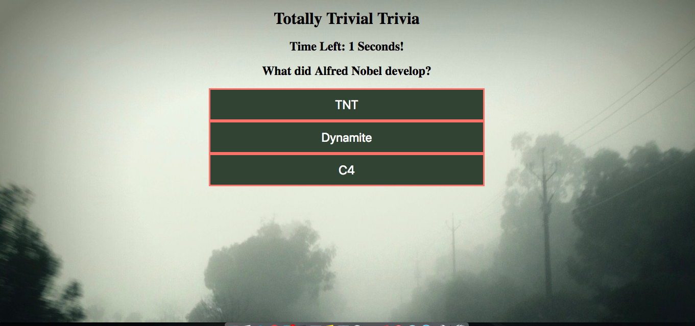

# Trivia Game
Week 5 Assignment: Trivia Game

## Totally Trivial Trivia

Created during Week 5 of University of Utah Coding Bootcamp. The assignment was to create a timed trivia game. Timer was set at 10 seconds for each question. Once the game is complete the final scoreboard reflects score based on unanswered and answered.

## Getting Started 
Play here: https://jfcslc801.github.io/triviaGame/

## Screenshots

