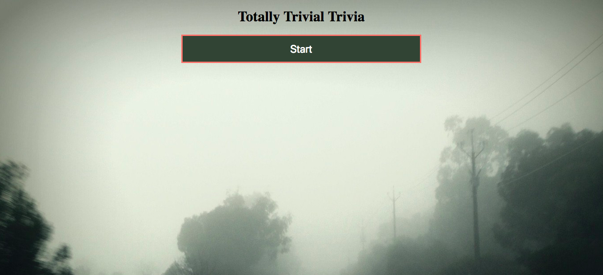
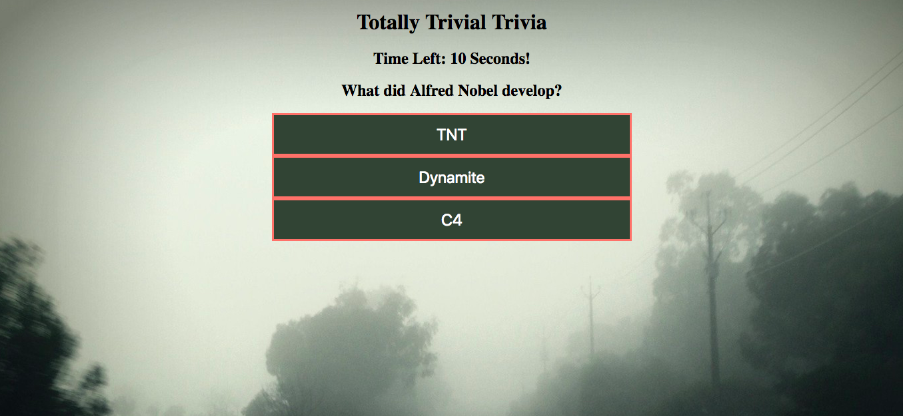
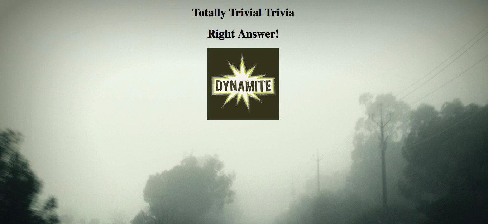
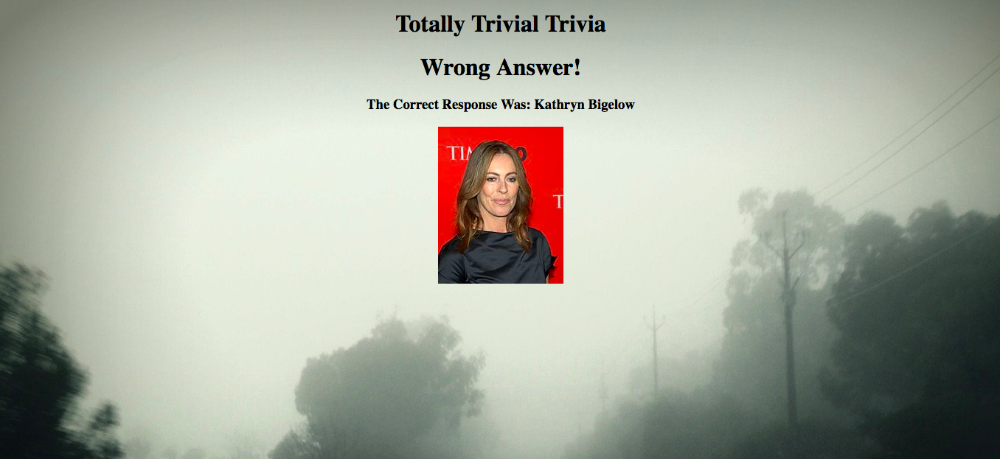
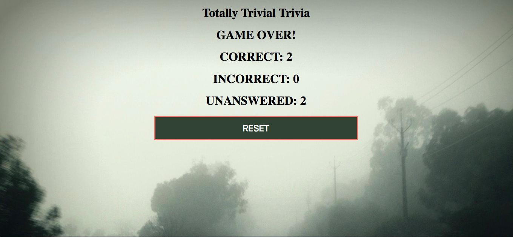

# Totally Trivial Trivia
University of Utah Coding Bootcamp Week 5 Assignment: Trivia Game!

---
Assignment: Create a timed trivia game. Timer set at 10 seconds for each question. Once the game is complete the final scoreboard reflects player score based on correct, incorrect and unanswered questions.

## Getting Started 
Play here: https://jfcslc801.github.io/triviaGame/

## Screenshots
Press start to begin!


Random questions loaded along with multiple choice answers.


Select right answer: 
-Right answer and image pops up.
-Sound plays.
-New question is generated.


Select wrong answer: 
-Right answer and image pops up.
-Sound plays.
-New question is generated.


Running out of time: 
-5 second warning sound plays.
When out of time:
-Right answer and image pops up.
-Sound plays.
-New question is generated.


Game complete: Players scores displayed based on correct, incorrect and unanswered questions. Game can be re started with reset button.


## Technologies used
- Bootstrap
- jQuery
- CSS
- Mario Bro's game tunes!


### Prerequisites

```
- Bootstrap: visit http://getbootstrap.com/getting-started/ for the CDN and link in html
- jQuery: visit http://code.jquery.com/ and link in html
```

## Built With

* VS - Visual Code Studio - Text Editor
* Bootstrap- Wireframe

## Authors
* **Jaime Franco Cerritos** - *HTML/CSS/JS* - [Jaime Franco Cerritos](https://github.com/jfcslc801)

## Acknowledgments

*University of Utah Coding Bootcamp for additional help.
